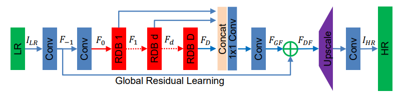

# 一、解题思路说明

## 待解决的问题
在超分辨率问题上，基于深度学习的方法取得了很大的进展与不错的效果。然而，大部分基于卷积神经网络（CNN）的超分辨率（SR）模型需要将图片预处理成固定的大小，这就导致了计算复杂度的增加；也有方法通过对最终卷积层的低分辨率图像进行 upscale，以解决需要预处理图片的问题。但这些方法存在一个共性：链式结构。这一结构只利用最后的卷积层提取的图像特征进行 upscale，浪费了原始低分辨率图片以及中间的卷积层提取的 hierarchical features，从而导致不能达到更好的效果。

## 整体思路
图像超分辨率文献 RDN: Residual Dense Network for Image Super-Resolution 提出了一种残差稠密网络，该网络结合 MDSR 中的残差块（Residual block）与 SRDenseNet 中的稠密块（Dense block），提出了残差稠密块（Residual Dense block）：单个 RDB 内的每层卷积层都和随后的卷积层连接，并将需要保存的信息传递至后续层，上一个 RDB 的输出通过 shortcut 输入到下一个 RDB 中的每一层卷积层，使得网络能够充分利用 RDB 中每一个卷积层提取出的低分辨率特征，之后，以一种全局的方式融合所有 RDBs 提取的 hierarchical feature，通过 global residual learning，结合低层特征和深层特征。

## 损失函数
选择 L<sub>1</sub> loss 函数，因为其有更强大的性能和收敛性。

## 网络结构



## 主要创新点
* 在 RDB 中引入 local dense connections，将 DenseNet 用于解决图片超分辨率问题，同时去掉 BN layers 和 pooling layers 以减小计算量，保存 pixel-level 信息。
* 提出 CM 机制，允许之前 RDB 的状态可以直接连接至当前 RDB 的每一层；允许更大的 growth rate，使 wide network 的训练更加稳定；利用 LRL 进一步促进信息和梯度的传递。


# 二、数据和模型使用

## 预训练模型的使用情况

没有使用预训练模型。


# 三、项目运行环境

## 项目所需的工具包/框架

python=3.7
pytorch=1.2.0

## 项目运行的资源环境

4 x TITAN Xp


# 四、项目运行方法

## 项目的文件结构
```
|—— dataset  
|     |—— video2png.sh  
|     |—— set_train.sh  
|     |—— set_val.sh  
|     |—— videos  
|     |     |—— gt  
|     |     |—— X4  
|     |     |—— test  
|     |—— pngs  
|     |     |—— gt  
|     |     |—— X4  
|     |     |—— test  
|     |—— SDR  
|     |     |—— trainset  
|     |     |     |—— HR  
|     |     |     |—— LR  
|     |     |     |     |—— X4  
|     |     |—— valset  
|     |     |     |—— HR  
|     |     |     |—— LR  
|     |     |     |     |—— X4  
|—— experiment  
|     |—— RDN_D16C8G64_BIx4  
|     |     |—— results-Demo  
|     |     |—— SR_4K  
|—— src  
|     |—— data    
|     |—— loss   
|     |—— model   
|     |—— auto_test.py   
|     |—— dataloader.py   
|     |—— demo.sh   
|     |—— main.py   
|     |—— option.py   
|     |—— template.py   
|     |—— trainer.py   
|     |—— utility.py   
|     |—— videotester.py   
|—— LICENSE  
|—— README.md
```

## 项目的运行步骤

### 1. 下载代码
`git clone https://github.com/Abundant-me/RDN`

### 2. 准备训练数据
* 下载数据包 SDR_4K（Part 1~4），统一将所有高分辨率视频文件解压至 ./dataset/videos/gt/ 目录下。
* 下载数据包 SDR_540p，将所有低分辨率视频文件解压至 ./dataset/videos/X4/ 目录下。
* 运行 video2png.sh 对两类视频进行抽帧，生成的图片分别存放在 ./dataset/pngs/gt 和 ./dataset/pngs/X4 目录下。
* 挑选 6 对视频片段作为验证集，其余 694 对视频片段作为训练集。
* 运行 set_train.sh 对每个训练集视频片段各抽取 10 帧作为训练数据：
    * 高分辨率视频抽取的图片存放在 ./dataset/SDR/trainset/HR 目录下。
    * 低分辨率视频抽取的图片存放在 ./dataset/SDR/trainset/LR/X4 目录下。
* 运行 set_val.sh 对每个验证集视频片段各抽取 2 帧作为验证数据：
    * 高分辨率视频抽取的图片存放在 ./dataset/SDR/valset/HR 目录下。
    * 低分辨率视频抽取的图片存放在 ./dataset/SDR/valset/LR/X4 目录下。

### 3. 开始训练
* 运行以下代码进行模型训练  
```
python main.py --scale 4 --save RDN_D16C8G64_BIx4 --model RDN \
--epochs 300 --batch_size 16  --patch_size 192 --data_train SDR --data_test SDR
```

### 4. 准备测试数据
* 下载数据包 SDR_540p，将所有低分辨率视频文件解压至 ./dataset/videos/test/ 目录下。

### 5. 开始测试
* 运行以下代码生成测试结果  
```
python auto_test.py
```

## 运行结果的位置
* 从测试视频抽出来的低分辨率视频帧存放在 ./dataset/pngs/test/ 目录下。
* 生成的高分辨率图片存放在 ./experiment/RDN_D16C8G64_BIx4/results-Demo/ 目录下。
* 生成的高分辨率视频存放在 ./experiment/RDN_D16C8G64_BIx4/SR_4K/ 目录下。
* 以上三个目录可分别通过 path_x4_png，path_x4_sr_png，path_x4_sr_video 进行修改。

